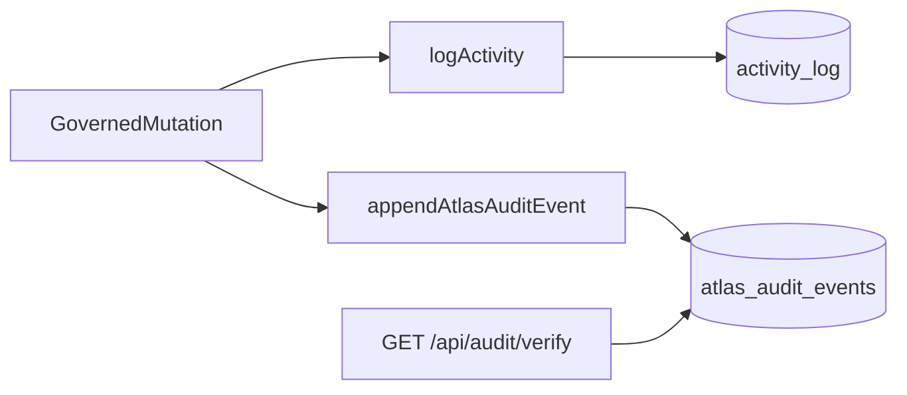

# ADR: Activity ↔ hash-chain integration

**Status:** accepted
**Date:** 2026-06-30
**Task:** PA-P2a
**Parent:** [Atlas + MoO import map](./2026-06-30-atlas-moo-import-map.md)
**Blocks:** PA-P2b–h (atlas-ontology mount + `/audit/verify` on fork)

## Context

Atlas legacy (`apps/api`) maintains a **hash-chained append-only audit log** (`AuditEvent` with
`event_hash` / `previous_event_hash`, verified by `verifyAuditEventChain` in `packages/ontology-core`).
This is the proof moat — tamper-evident, replayable, independent of UI narrative.

Paperclip maintains a separate **`activity_log`** PostgreSQL table (see `packages/db/src/schema/activity_log.ts`)
written via `logActivity()` in `server/src/services/activity-log.ts`. Activity is:

- company-scoped, human/agent readable, linked to `runId` and entities
- **not** hash-chained
- optimized for dashboard/search, not cryptographic verification

Replacing Activity with the hash-chain would break upstream Paperclip UX and merge drift.
Replacing the hash-chain with Activity alone would **lose the proof moat**.

## Decision

**Sidecar table + dual append on governed write path (Option C).**

1. **Keep `activity_log` unchanged** — Paperclip-native activity continues for UI, plugins, live events.
2. **Add `atlas_audit_events` table** — append-only hash chain per company, Atlas event shape.
3. **Single write helper** on Atlas-governed mutations: append Activity (when user-visible) **and**
   append hash-chained audit event (always for proof closure).
4. **Verify endpoint** reads only `atlas_audit_events`, not Activity.



## Rejected options

| Option | Why rejected |
| --- | --- |
| **A. Replace Activity with hash-chain** | Breaks Paperclip dashboard, upstream merges, run-id correlation |
| **B. Dual-write identical payload to Activity only** | Activity schema lacks chain fields; cannot verify tampering |
| **D. Add hash columns to `activity_log`** | High upstream conflict; couples proof to non-proof schema |
| **E. In-memory chain only (legacy parity)** | Lost on restart; incompatible with Paperclip Postgres runtime |

## Schema: `atlas_audit_events`

New Drizzle schema in `packages/db/src/schema/atlas_audit_events.ts` (Atlas-owned migration).

| Column | Type | Notes |
| --- | --- | --- |
| `id` | uuid PK | stable audit event id |
| `company_id` | uuid FK → companies | chain scope (was `workspace_id`) |
| `sequence` | integer | monotonic per company, starting at 1 |
| `actor` | text | agent id, user id, or `system` |
| `event_type` | text | e.g. `evidence.attached`, `record.promoted` |
| `resource_type` | text nullable | ontology record type |
| `resource_id` | text nullable | entity/statement id |
| `decision` | text | `allowed` / `denied` / `not_applicable` |
| `before_hash` | text nullable | sha256 of canonical before state |
| `after_hash` | text nullable | sha256 of canonical after state |
| `metadata` | jsonb | structured payload (no secrets) |
| `previous_event_hash` | text nullable | null for genesis event |
| `event_hash` | text | sha256(canonicalJson(event without event_hash)) |
| `activity_log_id` | uuid nullable FK → activity_log | optional cross-link |
| `run_id` | uuid nullable | correlate with Paperclip run when present |
| `created_at` | timestamptz | append time |

**Indexes:** `(company_id, sequence)` unique; `(company_id, created_at)`.

Hash algorithm: reuse `packages/atlas-ontology` (`canonicalJson`, `auditEventHash`, `verifyAuditEventChain`).

## Write path

New module: `server/src/services/atlas-audit-chain.ts`

```text
appendAtlasAuditEvent(db, {
  companyId,
  actor,
  eventType,
  resourceType?,
  resourceId?,
  decision,
  before?,
  after?,
  metadata?,
  activityLogId?,
  runId?,
}) → AuditEventRow
```

**Rules:**

- Append-only — no UPDATE/DELETE on `atlas_audit_events` (enforce via service + DB permissions later).
- Load last event for `company_id` to set `previous_event_hash` and `sequence` inside a transaction.
- `event_hash` computed before insert; reject if re-compute mismatch.
- For mutations that already call `logActivity`, pass returned activity id as `activityLogId`.

**Governed mutations that MUST append audit** (minimum set for PA-P2g):

- knowledge record create/update/lifecycle promote
- tool call allow/deny (agent gateway on fork)
- policy denial on write path
- review packet / approval outcome (when grafted PA-P2M4)

Activity-only events (heartbeat logs, attachment bytes) do **not** require audit chain unless they change authoritative knowledge state.

## Read / verify path

| Endpoint | Behavior |
| --- | --- |
| `GET /api/companies/:companyId/audit/verify` | Load all events for company ordered by `sequence`; run `verifyAuditEventChain`; return `{ valid, errors, event_count }` |
| `GET /api/audit/verify` | **Deprecated alias** — requires `companyId` query param; fails closed if missing |

Legacy `GET /audit/verify` on `:4000` remains on migration reference until `apps/api` retired.

Optional (PA-P3+): `GET /api/companies/:companyId/audit/events?limit=&cursor=` for review packets — not required for PA-P2g gate.

## Mapping: Atlas AuditEvent ↔ Paperclip Activity

| Atlas (legacy) | Paperclip Activity | Sidecar |
| --- | --- | --- |
| `workspace_id` | `companyId` | `company_id` |
| `event_type` | `action` (similar, not identical) | `event_type` (Atlas canonical) |
| `resource_type` / `resource_id` | `entityType` / `entityId` | same on sidecar |
| `metadata` | `details` | `metadata` (may be subset) |
| `actor` | `actorId` + `actorType` | `actor` string |
| — | `runId` | `run_id` optional |
| `event_hash` chain | — | **sidecar only** |

Do not auto-derive hash chain from Activity rows — chain integrity requires dedicated append path.

## Implementation tasks

| Task | Deliverable |
| --- | --- |
| PA-P2b | `packages/atlas-ontology/` (hash helpers + validators) |
| PA-P2c | Port ontology-core tests to atlas-ontology harness |
| PA-P2g | `atlas_audit_events` migration + service + verify route |
| PA-P2M3 | Policy denials append `decision: denied` events |
| PA-P3g | knowledge-pack test asserts `audit/verify` valid after full loop |

## Testing

| Test | Location |
| --- | --- |
| Hash chain unit tests | `packages/atlas-ontology/test/audit-chain.test.js` (ported PA-P2c) |
| Service append + verify integration | `server/src/services/atlas-audit-chain.test.ts` (new PA-P2g) |
| HTTP verify route | `server/src/routes/atlas-audit.test.ts` or extend API tests (PA-P2g) |
| ADR doc presence | `scripts/test/audit-integration-adr.test.js` |

**PA-P2g acceptance:** seeded company mutations → `GET /api/companies/:id/audit/verify` returns `{ valid: true }`; tampered row in test DB → `{ valid: false }`.

## Non-goals (this ADR)

- Lean/ZK proof hooks (PA-P5)
- External audit retention / compliance export
- Rewriting Paperclip Activity UI to show hash chain
- Cross-company chain (each company is an independent chain)

## Acceptance (PA-P2a)

- [x] Option chosen with rationale
- [x] Schema and write/verify paths specified
- [x] Mapping to legacy AuditEvent documented
- [x] Rejected options recorded
- [x] Implementation tasks traced to PA-P2b/c/g

**Next task:** PA-P2b — copy `packages/ontology-core` → `packages/atlas-ontology`.
